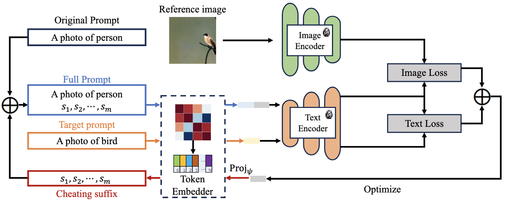

## MMP-Attack

This repository is the official repository for our paper "Cheating Suffix: Targeted Attack to Text-To-Image Diffusion Models with Multi-Modal Priors" 

<p align="center">
  
</p>

### Setup
Install PyTorch, diffusers==0.17.0, and transformers==4.29.1.

Download the [Stable Diffusion model](https://huggingface.co/CompVis/stable-diffusion-v1-4) and [CLIP model](https://huggingface.co/openai/clip-vit-large-patch14).

### Running Commands

You can execute the following command to perform a targeted attack, transforming the category "car" into "bird":
```
python attack.py --ori_sentence "a photo of car" --target_word bird 
```
